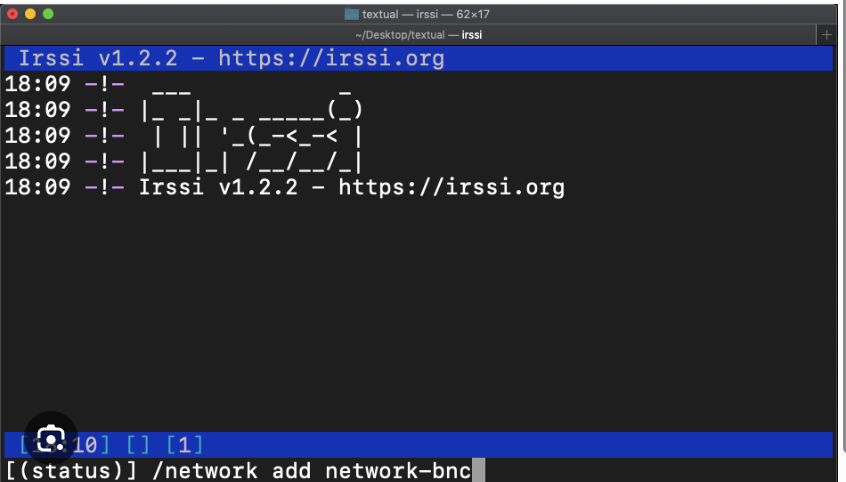

## 환경  

운영체제 : Ubuntu  
언어 : C++ 98 (요구사항)  
빌드 : GNU Make (요구사항)  
코딩 표준 : [POCU C++](https://docs.popekim.com/ko/coding-standards/pocu-cpp)  
협업 : Git, [Notion](https://www.notion.so/irc-1b50d57d3189805a9b1cea776d5c964d), Slack  

## 방향  

실시간으로 채팅해야 하기 때문에 Stateful 방식을 생각했습니다.  
또한, 상용화 된 클라이언트 프로그램 중 하나는 호환 할 수 있어야 했기 때문에 Client-Server 방식으로 만들었습니다.  

호환할 클라이언트 프로그램은 irssi를 선택했습니다.  
ex)

클라이언트 프로그램과 통신하기 위해 IRC 프로토콜에 따라 구현했으며, 이는 RFC 문서를 통해 확인했습니다.  

RFC [2811](https://datatracker.ietf.org/doc/html/rfc2811), [2812](https://datatracker.ietf.org/doc/html/rfc2812)  